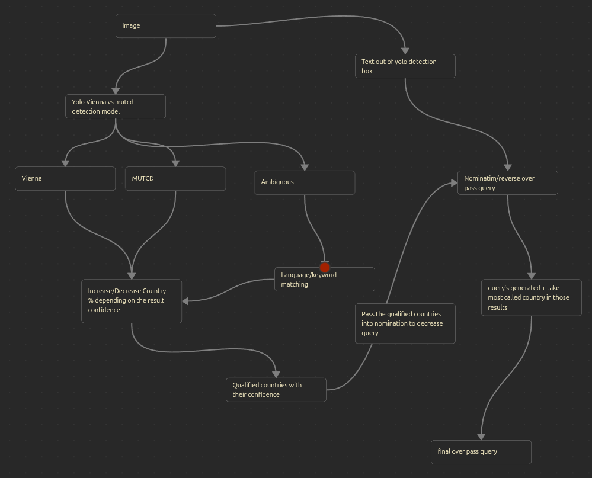
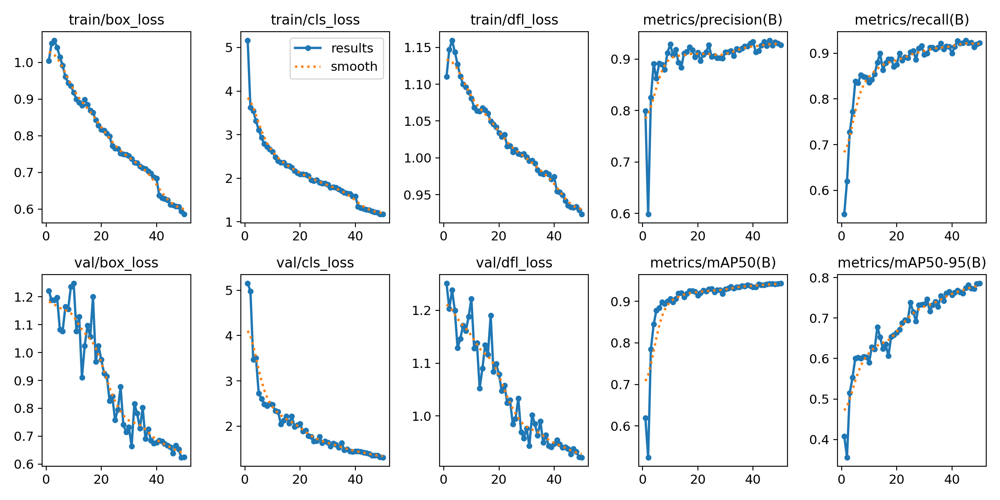
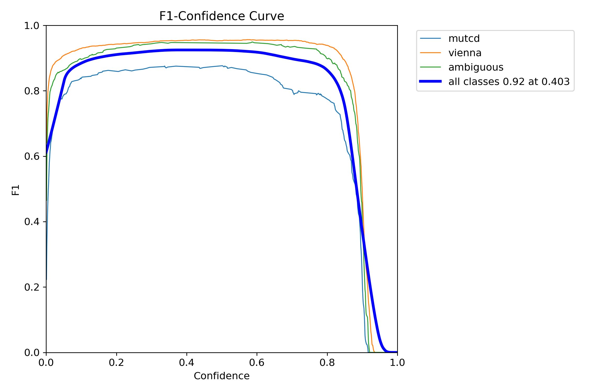
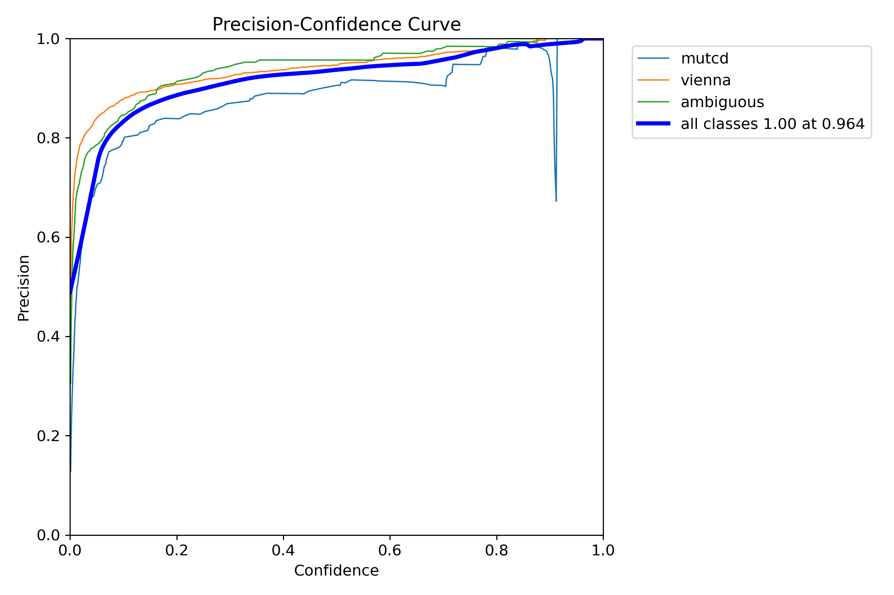
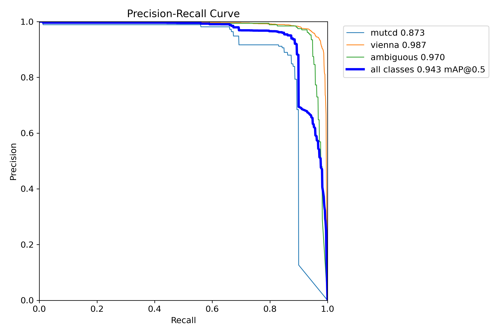
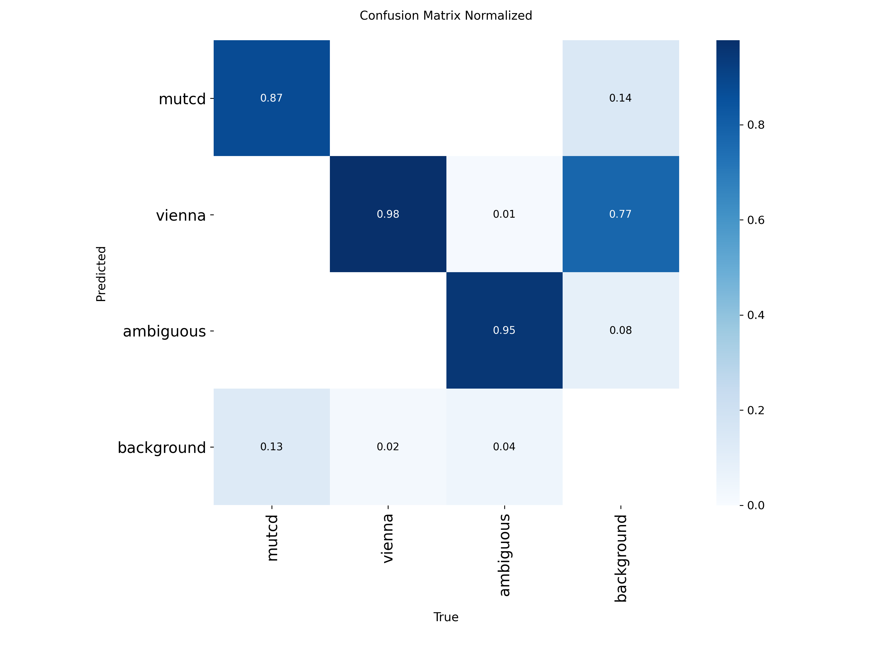
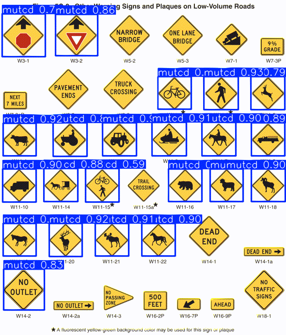
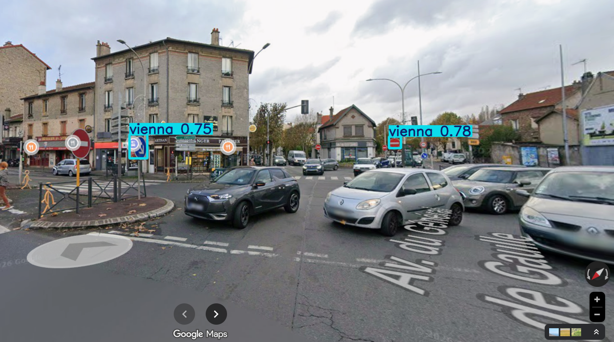
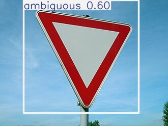

# GeoGuessr Location Assistant (Final Year Project, Submitted in partial fulfilment of the requirements for the degree of Licence in Computer Science)

Street-level image analysis pipeline that extracts geographic clues from images
(road signs, architecture, language) using YOLOv8, OCR, and OpenStreetMap
to infer country and region.

## Stack
- **end_logic** — YOLOv8 detection, OCR, Overpass/Nominatim queries
- **backend** — API serving end_logic results
- **frontend** — UI chatbot
- **data_prep** -- custom merged dataset preparation for finetuning YOLOv8

## How It Works

### General pipeline:



The whole logic in the pipeline is eliminating and filtering countries. the elimination system was mostly executed by visual clues that determined were the country follows vienna or mutcd convention (u can check the whole thing here: https://en.wikipedia.org/wiki/Vienna_Convention_on_Road_Signs_and_Signals). this alone can split the whole world on 3 regions but its not equal in terms of clusters or size. we get results of yolo that are in this shape:

```bash
Detected: vienna | conf: 0.85 | box: [1434.0308837890625, 322.5564880371094, 1491.0142822265625, 371.571044921875]
Speed: 2.0ms preprocess, 236.6ms inference, 1.3ms postprocess per image at shape (1, 3, 320, 640)
```

to properly say whether the result is vienna or mutcd favored we can calculate the bias of the total confidence of our resuls:

```bash
bias = (total_vienna_confidence - total_mutcd_confidence) / (total_vienna_confidence + total_mutcd_confidence)
```

 - if `bias`>0 then we lean to **vienna**
 - elif `bias`<0 then we lean to **mutcd**
 - else mixed/ambiguous we do nothing

and to be safe we set a thresh hold thats dependant on bias_confident:

 - if `bias_confidence`>0.7 -> `threshold` = 0.2
 - elif `bias_confidence`>0.4 -> `threshold` = 0.3
 - else -> `threshold` = 0.5

finally:

 - if `bias>threshold` -> **vienna**
 - elif `bias<-threshold` -> **mutcd**
 - else -> **hybrid** 

it is not yet fully optimized for accuracy so we pass by another layer of filtering which is the language filtering. simply by using ocr and detecting the language after fixing that captured string by regex formulas

```bash
\d{1,2}[:/]\d{1,2} #filters date/time
^\d{1,2}\s+[a-z] #filter ocr junk
^\d+$ #treat pure numbers as speed limit candidates
```
and in the output we mainly care about two factors which are whether the text was in the bounds of the yolo detections or outside of it. if its outside we use nominatim to get our overpass query proper nodes with their type so we win time and accuracy else we treat it directly as an overpass node which is speed limit.

at the end we get this form of result:

```json
{
  "YOLO_detections": {
    "dominant_convention": "vienna | mutcd | hybrid",
    "bias": 0.42
  },
  "sign_detection": {
    "detected": "vienna",
    "conf": 0.91
  },
  "ocr_detections": "Main OCR text extracted from signs",
  "language": "en",
  "safe_geolocalization": {
    "lon": 2.3522,
    "lat": 48.8566
  },
  "candidates": [
    { "lat": 48.8566, "lon": 2.3522 },
    { "lat": 45.7640, "lon": 4.8357 }
  ],
  "top_countries": ["France", "Belgium", "Switzerland"]
}
```

### Training And Dataprep

i came across the idea of mixing 2 labeled datasets of 2 seperate models into one. mutcd is basically how america intended it to be and vienna how europe did it so i combined these datasets:
  - Us Road Signs: https://universe.roboflow.com/us-traffic-signs-pwkzx/us-road-signs 
  - European Road Signs: https://universe.roboflow.com/radu-oprea-r4xnm/traffic-signs-detection-europe
  
Classes were reduced using the following rule: 

```bash
if class != "yield" or "stop":
    reduce classes to base dataset origin
```

basically reduce all classes into one (mutcd/vienna) if the class isnt yield or stop (beceause that sign is common between these two).

we evaluate YOLO using box precision, recall, F1, mAP50, mAP50-95 and the confusion matrix to measure both detection quality and class confusion











### Example of detections:






## Getting Started

### Prerequisites
- Python 3.10+
- Node.js (for frontend)

### Installation
```bash
# clone the repo
git clone https://github.com/yourusername/geoguessr_assistant.git
cd geoguessr_assistant

# create and activate venv
python -m venv .venv
source .venv/bin/activate        # linux/mac
.venv\Scripts\Activate.ps1      # windows PowerShell
.venv\Scripts\activate.bat      # windows cmd

# install dependencies
pip install -r requirements.txt
```

### Run
```bash
# backend
cd backend
uvicorn main:app --reload

# frontend
cd frontend
npm install
npm run dev
```
### you can run the assistant alone by:
```bash
source .venv/bin/activate        # linux/mac
.venv\Scripts\activate           # windows
cd assistant_logic/
python main.py <path to ur image>

```
## Model Weights
you can mine thats in the `assistant_logic/yolo_pts/best2.pt` (set by default).
