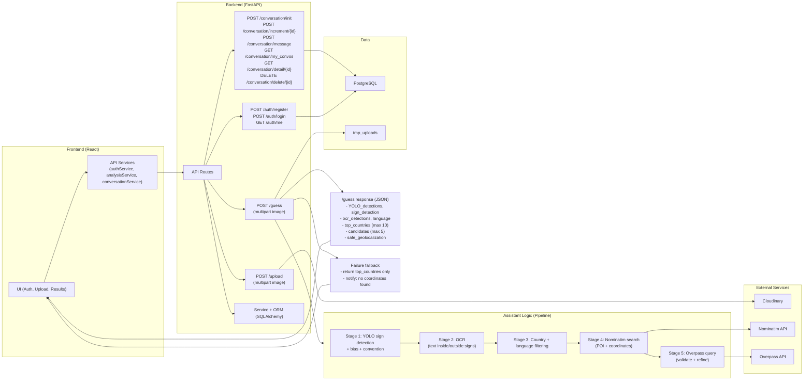

# Diagramme général (architecture)

```mermaid
flowchart LR
    subgraph Frontend["Frontend (React)"]
        UI["UI (Auth, Upload, Results)"]
        FS["API Services\n(authService, analysisService, conversationService)"]
        UI --> FS
    end

    subgraph Backend["Backend (FastAPI)"]
        API["API Routes"]
        AUTH["POST /auth/register\nPOST /auth/login\nGET /auth/me"]
        GUESS["POST /guess\n(multipart image)"]
        UPLOAD["POST /upload\n(multipart image)"]
        CONVO["POST /conversation/init\nPOST /conversation/increment/{id}\nPOST /conversation/message\nGET /conversation/my_convos\nGET /conversation/detail/{id}\nDELETE /conversation/delete/{id}"]
        DBLayer["Service + ORM (SQLAlchemy)"]
        API --> AUTH
        API --> GUESS
        API --> UPLOAD
        API --> CONVO
        API --> DBLayer
    end

    subgraph Assistant["Assistant Logic (Pipeline)"]
        YOLO["Stage 1: YOLO sign detection\n+ bias + convention"]
        OCR["Stage 2: OCR\n(text inside/outside signs)"]
        Filters["Stage 3: Country + language filtering"]
        NOM["Stage 4: Nominatim search\n(POI + coordinates)"]
        OVP["Stage 5: Overpass query\n(validate + refine)"]
        YOLO --> OCR --> Filters --> NOM --> OVP
    end

    subgraph External["External Services"]
        Cloudinary["Cloudinary"]
        Nominatim["Nominatim API"]
        Overpass["Overpass API"]
    end

    subgraph Data["Data"]
        Postgres["PostgreSQL"]
        Tmp["tmp_uploads"]
    end

    FS --> API
    GUESS --> Assistant
    UPLOAD --> Cloudinary
    CONVO --> Postgres
    AUTH --> Postgres
    GUESS --> Tmp
    NOM --> Nominatim
    OVP --> Overpass

    RESP_GUESS["/guess response (JSON)\n- YOLO_detections, sign_detection\n- ocr_detections, language\n- top_countries (max 10)\n- candidates (max 5)\n- safe_geolocalization"]
    RESP_FAIL["Failure fallback\n- return top_countries only\n- notify: no coordinates found"]

    GUESS --> RESP_GUESS --> UI
    GUESS --> RESP_FAIL --> UI
```
