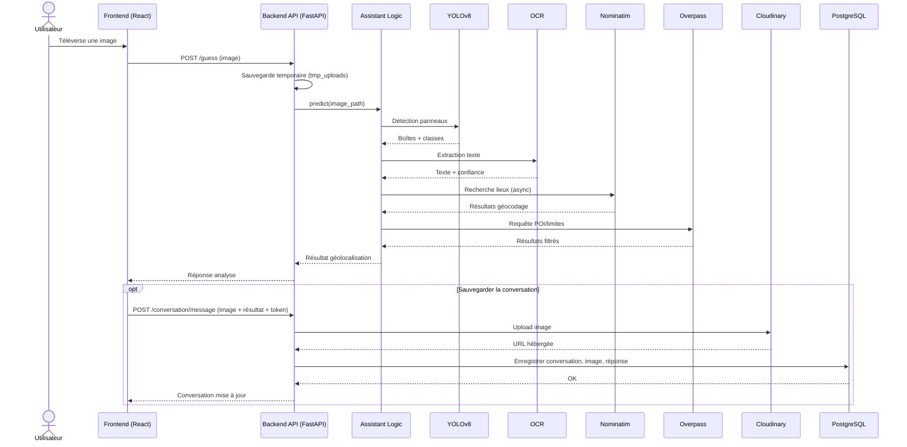

# Diagramme de séquence — Analyse et sauvegarde

```mermaid
sequenceDiagram
    actor Utilisateur
    participant Frontend as Frontend (React)
    participant Backend as Backend API (FastAPI)
    participant Assistant as Assistant Logic
    participant YOLO as YOLOv8
    participant OCR as OCR
    participant Nominatim as Nominatim
    participant Overpass as Overpass
    participant Cloudinary as Cloudinary
    participant DB as PostgreSQL

    Utilisateur->>Frontend: Téléverse une image
    Frontend->>Backend: POST /guess (image)
    Backend->>Backend: Sauvegarde temporaire (tmp_uploads)
    Backend->>Assistant: predict(image_path)
    Assistant->>YOLO: Détection panneaux
    YOLO-->>Assistant: Boîtes + classes
    Assistant->>OCR: Extraction texte
    OCR-->>Assistant: Texte + confiance
    Assistant->>Nominatim: Recherche lieux (async)
    Nominatim-->>Assistant: Résultats géocodage
    Assistant->>Overpass: Requête POI/limites
    Overpass-->>Assistant: Résultats filtrés
    Assistant-->>Backend: Résultat géolocalisation
    Backend-->>Frontend: Réponse analyse

    opt Sauvegarder la conversation
        Frontend->>Backend: POST /conversation/message (image + résultat + token)
        Backend->>Cloudinary: Upload image
        Cloudinary-->>Backend: URL hébergée
        Backend->>DB: Enregistrer conversation, image, réponse
        DB-->>Backend: OK
        Backend-->>Frontend: Conversation mise à jour
    end
```
